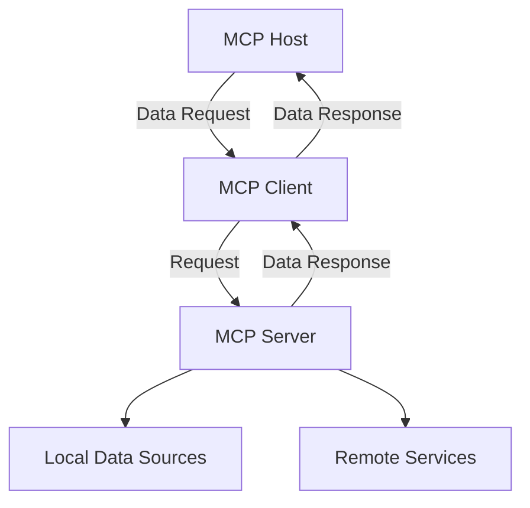

# Learning MCP (Model Context Protocol)

https://modelcontextprotocol.io/

MCP (Model Context Protocol) is an open protocol that standardizes how applications provide context to large language models (LLMs). Similar to USB-C, MCP offers a universal way to connect AI models to various data sources and tools.

### Key Features
- **Flexibility**: Easily switch between LLM providers and vendors.
- **Security**: Implements best practices to keep data secure within your infrastructure.
- **Scalability**: Provides a list of pre-built integrations that LLMs can directly connect to.

### Architecture

MCP is based on a client-server architecture, allowing host applications to connect to multiple servers. The main components include:
- **MCP Host**: Applications like IDEs or AI tools that access data through MCP.
- **MCP Client**: Protocol clients that maintain one-to-one connections with servers.
- **MCP Server**: Lightweight programs that expose specific functionalities via MCP.
- **Local Data Sources**: Securely access files, databases, and services on your computer.
- **Remote Services**: External systems accessible via APIs.

## Example Servers / Clients

- [Quickstart](https://modelcontextprotocol.io/quickstart/)
- [MCP Servers](https://modelcontextprotocol.io/examples)
- [MCP Clients](https://modelcontextprotocol.io/clients)

## SDK Links

Here are the official SDKs for MCP:

- [Python SDK](https://github.com/modelcontextprotocol/python-sdk)
- [TypeScript SDK](https://github.com/modelcontextprotocol/typescript-sdk)
- [Java SDK](https://github.com/modelcontextprotocol/java-sdk)
- [Kotlin SDK](https://github.com/modelcontextprotocol/kotlin-sdk)
- [C# SDK](https://github.com/modelcontextprotocol/csharp-sdk)
