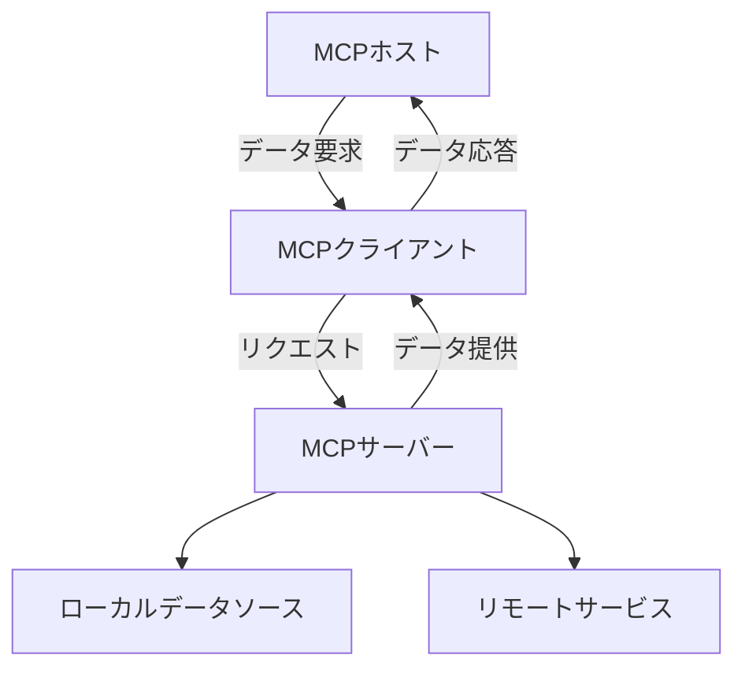

# Learning MCP (Model Context Protocol)

https://modelcontextprotocol.io/

MCP（Model Context Protocol）は、アプリケーションが大規模言語モデル（LLM）にコンテキストを提供する方法を標準化するオープンプロトコルです。USB-Cのように、MCPはAIモデルをさまざまなデータソースやツールに接続するための標準的な方法を提供します。

### 主な特徴
- **柔軟性**: LLMプロバイダーやベンダー間で簡単に切り替え可能。
- **セキュリティ**: インフラ内でデータを安全に保つためのベストプラクティスを提供。
- **拡張性**: LLMが直接接続できる事前構築された統合のリストを提供。

### アーキテクチャ

MCPはクライアント-サーバーアーキテクチャに基づいており、ホストアプリケーションが複数のサーバーに接続可能です。主なコンポーネントは以下の通りです：
- **MCPホスト**: IDEやAIツールなど、MCPを通じてデータにアクセスするアプリケーション。
- **MCPクライアント**: サーバーと1対1の接続を維持するプロトコルクライアント。
- **MCPサーバー**: MCPを通じて特定の機能を公開する軽量プログラム。
- **ローカルデータソース**: コンピュータ内のファイル、データベース、サービスに安全にアクセス可能。
- **リモートサービス**: APIを通じてアクセス可能な外部システム。

## SDK Links

Here are the official SDKs for MCP:

- [Python SDK](https://github.com/modelcontextprotocol/python-sdk)
- [TypeScript SDK](https://github.com/modelcontextprotocol/typescript-sdk)
- [Java SDK](https://github.com/modelcontextprotocol/java-sdk)
- [Kotlin SDK](https://github.com/modelcontextprotocol/kotlin-sdk)
- [C# SDK](https://github.com/modelcontextprotocol/csharp-sdk)

